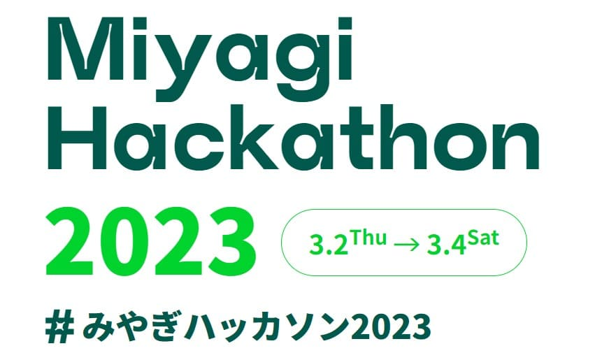
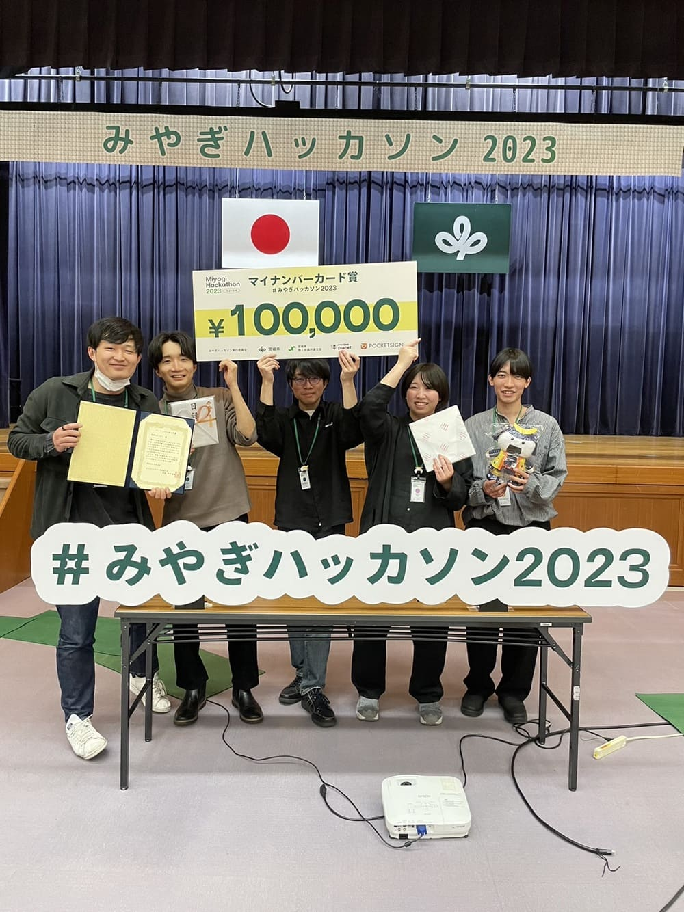

# [Miyagi hackathon 2023](https://2023.hackathon.miyagi.jp/)

### [公式 HP はこちら](https://2023.hackathon.miyagi.jp/)

### チームについて

- チーム名： **青翠のまじんこ**（唯一の県内学生のみのチームです．）
- メンバー：
  - Muragami (東北大学)
  - seiya (東北大学)
  - うに (東北大学)
  - たむらゆうた (東北大学)
  - ゆうすけ (東北大学)

#### 役割分担

- 企画原案：全員
- チームリーダー・プレゼン・ディレクター：**seiya**
- 開発：
  - フロントエンド・デザイン：**うに，Muragami**
  - バックエンド：**たむらゆうた，ゆうすけ**

### 提案サービス：「スポット本人確認」

マイナンバーカードの電子署名機能と個人情報を用いて，いつでもどこでも本人確認ができるというアイデアです．

シェアリングエコノミーの台頭を鑑みて，貸出主が顧客の本人確認を手軽にできるように，本人確認が可能なシステムの提案及びデモの実装を行いました．

### 結果：マイナンバーカード賞を受賞しました！

