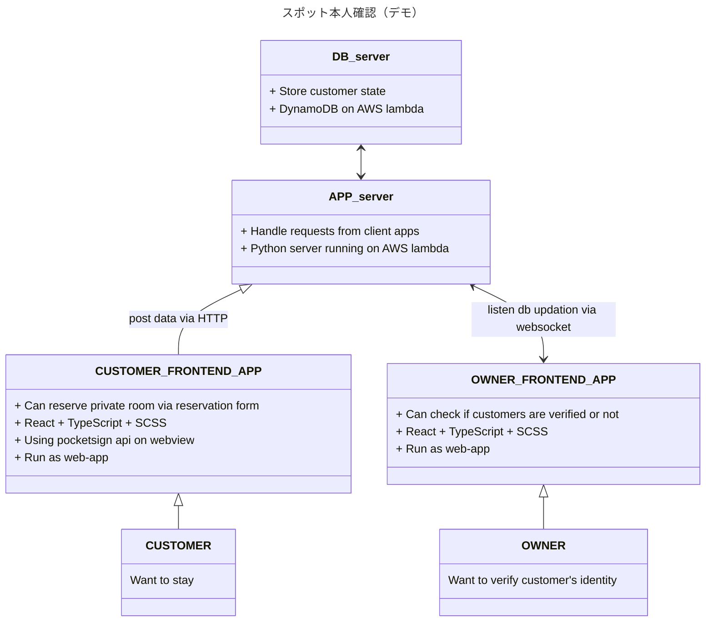

# [Miyagi hackathon 2023](https://2023.hackathon.miyagi.jp/)

#### [公式 HP はこちら](https://2023.hackathon.miyagi.jp/)

### 結果：マイナンバーカード賞を受賞しました！

### チームについて

- チーム名： **青翠のまじんこ**（唯一の県内学生のみのチームです．）
- メンバー：
  - Muragami (東北大学)
  - seiya (東北大学)
  - うに (東北大学)
  - たむらゆうた (東北大学)
  - ゆうすけ (東北大学)

#### 役割分担

- 企画原案：全員
- チームリーダー・プレゼン・ディレクター：**seiya**
- 開発：
  - フロントエンド・デザイン：**うに，Muragami**
  - バックエンド：**たむらゆうた，ゆうすけ**

### 提案サービス：「スポット本人確認」

マイナンバーカードの電子署名機能と個人情報を用いて，いつでもどこでも本人確認ができるというアイデアです．

シェアリングエコノミーの台頭を鑑みて，貸出主が顧客の本人確認を手軽にできるように，本人確認が可能なシステムの提案及びデモの実装を行いました．

#### 実装したデモアプリケーションの構成

##### 登場人物

- 顧客：民泊を予約したい
- 民泊の貸し主（オーナー）：貸し出している民泊の予約客本人かどうかを確かめたい

現状，現地での煩雑な本人確認作業が必要であり，特に民泊の場合は現地での顔写真撮影が必要等の理由から，オーナー側が設備を別途用意する必要があるケースがあります．また，宿泊客は現地で身分証明書を提出する必要があったり，署名を行う必要があり，これは煩雑です．

スマートフォンとマイナンバーカードの機能を組み合わせ，これらを半自動化する仕組みが「スポット本人確認」です．

本人確認が必要な場所において，ピンポイントで手軽に本人確認を行うことができ，オーナーの負担軽減及び，よりシンプルな手続きを通して，宿泊客の一貫した UX 体験の保証を実現します．

##### アプリケーション

- CUSTOMER_FRONTEND_APP
  - 顧客用予約フォーム（スポット本人確認 api による本人確認機能つき）
- OWNER_FRONTEND_APP
  - 民泊オーナー用の宿泊予定客チェックイン確認画面
- APP_server
  - 各種フロントエンドアプリケーションからの CRUD リクエストを処理
- DB_server
  - 顧客情報を格納するデータベース
  - 個人情報の他，本人確認済みか否か等のステータスも管理
